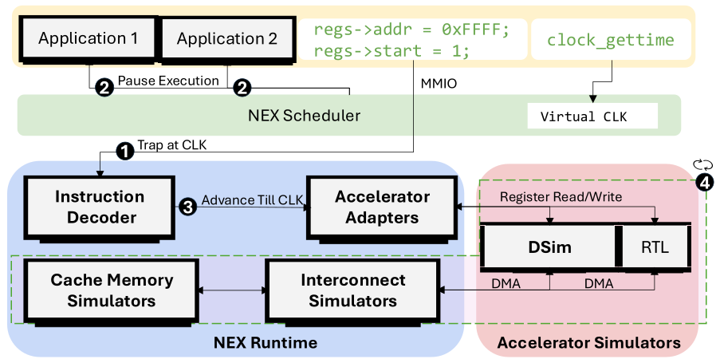

# NEX - Hardware Accelerator Full-Stack Simulation Framework

NEX is a simulation framework for running hardware-accelerated software full-stack end-to-end. NEX supports unmodified software stacks except that drivers for accelerators need to be modified slightly for NEX to interpose between software and hardware. 

NEX runs software on actual CPUs without simulating any CPU architectures. NEX does support simulating more virtual CPUs than what's available.   

NEX supports hardware accelerator simulators in the form of RTL simulators or DSim (LPN-based simulator models). Accelerators including Versatile Tensor Accelerator (VTA), hardware JPEG Decoder, and Protobuf serialization/deserialization accelerator (Protoacc) are integrated into NEX right now. NEX can run multiple such accelerators as configured. 

NEX supports host-accelerator interconnect modeling and DMA latency modeling as well. 

NEX supports time-warp features that let users manipulate timestamps in the application. 

## Features

- **Multi-Accelerator Support**: VTA, JPEG decoder, and Protoacc accelerators
- **Dual Simulation Modes**: RTL simulation and fast decoupled functional/performance di-simulation (DSim)
- **Host-Accelerator Interaction**: Modeling of interconnect and memory subsystem
- **Scalable Architecture**: Support for multiple accelerator instances
- **BPF-based Scheduling**: Controlling CPU execution based on [SCX](https://github.com/sched-ext/scx). 

## Architecture



## Building

### Installing the Kernel
Install kernels that have SCX support, check [SCX](https://github.com/sched-ext/scx) repo for installation guide.

For example, on Ubuntu 24.04: 

```
$ sudo add-apt-repository -y --enable-source ppa:arighi/sched-ext
$ sudo apt install -y linux-generic-wip scx
$ sudo reboot
```

### Build the NEX repo
1. Clone the NEX repo then initialize submodules.
```
git submodule update --init --recursive
```
2. Make scx 
```
sudo make scx -j
```
3. Configure NEX
```
make menuconfig
```
4. Make the project. 
```
make -j
make dsim -j
```
5. Install NEX so you can use it in other directories
```
sudo make install
```

## Configuration

NEX uses a Kconfig-based configuration system. Key configuration options:

### Host Simulation Modes
- **ROUND_BASED_SIM**: Epoch-based CPU scheduling with configurable time slices
- **TOTAL_CORES**: Enter the total number of cores on this system here
- **SIM_CORES**: Enter the number of cores you want to use for NEX simulation
- **SIM_VIRT_CORES**: Enter the number of virtual cores you want NEX to simulate; leave it 0 if you want every thread to run on a virtual core
- **ROUND_SLICE**: Enter the epoch duration. 
- **EXTRA_COST_TIME**: Adjustment for the epoch duration. If you don't know what to set, try `make autoconfig`; NEX runs a script to find out 
- **DEFAULT_ON_OFF**: Whether you want to turn epoch-based scheduling on by default or not. Note: you can always turn the scheduling on or off in the application. When the scheduling is on, the application gets a slowdown of 10-20x

### Accelerator Interactive Mode
- **USE_FAULT**: NEX captures host-to-accelerator communication by segfaults
- **USE_TICK**: NEX captures host-to-accelerator communication by illegal instructions as ticks (all accelerators integrated into NEX are now using this mode)
- **EAGER_SYNC**: Turn on eager synchronization
- **EAGER_SYNC_PERIOD**: Eager sync period in nanoseconds 

### Accelerator Configuration
- **VTA**: Versatile Tensor Accelerator
- **JPEG**: JPEG Decoder Accelerator
- **Protoacc**: Protoacc Accelerator

For each accelerator, you can configure:
- **DSIM**: Functional/performance decoupled simulator based on LPN
- **LEGACY_DSIM**: The same DSim simulator but compiled together with nex and integrated more tightly with NEX, however this is less modular. In this mode, nex can only be configured with one accelerator at a time. Legacy dsim is faster than DSIM, but we recommend using DSim instead of legacy DSim.
- **RTL**: Verilator compiled RTL simulators
- **FREQ**: Frequency of the accelerator in MHz
- **LINK_DELAY**: Link delay between the accelerator and host in nanoseconds (for example, PCIe link delay is typically a few hundred nanoseconds).
- **NUM**: Number of accelerator instances.

### Memory Subsystem
- **MEM_LPN**: Memory subsystem simulator based on LPN
- **CACHE_HIT_LATENCY**: Set the cache hit latency in nanoseconds
- **CACHE_MISS_FETCH_LATENCY**: Set the cache miss fetch latency in nanoseconds 
- **CACHE_FIRST_HIT**:  Set whether the first access to an empty cacheline is considered a hit or a miss
- **CACHE_SIZE**: Set cache size in KB.
- **CACHE_ASSOC**: Set cache associativity.

## Usage

You can start NEX simulation simply by running the command:
```
sudo nex <your application>
```
Note: if you want to run multiple commands, you can put all your commands in a script, then run 
```
sudo nex <your script>
```
Note: sudo will reset your environment variables, use `sudo -E` to keep those.

Note: if you set extra environment variables when launching nex, set it before, for example `SOME_ENV=1 nex`.

### Running Prepared Experiments

Prepared experiments are available in `experiments/`:

### Configuring NEX

You only need to enter the following 3 configs.

- **TOTAL_CORES**
- **SIM_CORES**: leave 8 cores at least
- **EXTRA_COST_TIME**

Then run the following to update experiments settings
```bash
cd experiments/
./update_configs_for_all_exp.sh
```

This script will print `Verification (first few updated files)` at the end, please double check the udpated config is what you entered, if mismatch is found, try to `make menuconfig` in NEX, change some config to save the configs again. Then repeat `./update_configs_for_all_exp.sh`.   

### VTA
Install environment first (note: you might need to fix environment issues manually, as noted in the build-tvm.sh).
```bash
cd experiments/
./build-tvm.sh
cd vta_exp/
./run_all.sh
``` 
### JPEG
```bash
cd jpeg_exp/
./run_all.sh
```

### Protoacc
```bash 
cd protoacc_exp
./run_all.sh
```

### Results
The results are all in `<NEX_Path>/results`.

Running the following will compile the results into a Python dictionary stored in `results/scripts/compiled_data`
```bash
cd results/scripts
python extract_jpeg.py
python extract_protoacc.py
python extract_vta.py
```

Note: to plot the results in comparison with the gem5-based simulator, you need to copy the compiled results to `results/scripts/gem5_compiled_data` after running gem5, then do similary extraction, then run 
```bash
python plot_simtime_speedup.py
```
Note: If your environment can't run plot, source the env we created for VTA/TVM experiments. Run this command first: `source <NEX-path>/experiments/tvm-vta-env/bin/activate`

To run gem5-related experiments, please refer to repo `https://github.com/dslab-epfl/SimBricks-LPN/`. Note, the gem5 is configured to match `Intel(R) Xeon(R) Gold 6248R CPU @ 3.00GHz`, if you run nex on a different CPU and compare results with gem5-based experiments, you may observe large differences because the CPUs don't match. 

(Or if you'd like to run inside containers for gem5-related experiments, refer to the repo here `https://github.com/dslab-epfl/NEXDSIM_AE.git`, but the repo is still under testing.)


## Contact

If you have any questions or suggestions, feel free to reach out to us at (jiacheng.ma@epfl.ch).